# EduFusionBD — Institutional Architecture & Codebase Audit

**Document ID:** `ARCH-AUDIT-2026-07-26`
**Subject:** EduFusionBD School Management System (`edufusionbd-web` + Supabase tier)
**Audit type:** Full-stack architecture, codebase quality, security, scalability, operability
**Method:** Direct source inspection — 247 TypeScript/TSX files (21,139 LOC), 35 SQL migrations (3,175 LOC, 84 tables), build config, CI pipeline, lint policy, test suite
**Prepared for:** Engineering leadership / final-year defense panel
**Supersedes in scope:** `docs/ENGINEERING_AUDIT.md` (2026-07-25) — that audit covered *production readiness*; this one covers *architecture*. Findings there that are now fixed are marked ✅ below.

---

## 0. How to read this report

Every finding carries an ID, a severity, and a **file:line citation you can open**. No finding in this document is inferred from documentation, comments, or prior reports — each was read out of the source during this audit. Where a claim in the codebase's own comments turned out to be *inaccurate*, that is called out explicitly, because a false safety claim is more dangerous than a known gap.

| Severity | Meaning | Response time |
|---|---|---|
| **C — Critical** | Exploitable now, or guarantees data loss/corruption at production scale | Before any real school is onboarded |
| **H — High** | Breaks at the stated scale target, or a security control that does not actually work | Before pilot with >1 school |
| **M — Medium** | Real maintenance/performance cost, compounds over time | Next 1–2 sprints |
| **L — Low** | Polish, consistency, developer experience | Backlog |

---

# 1. Executive Architecture Review

## 1.1 Overall system assessment

EduFusionBD is a **Next.js 15 App Router frontend talking directly to a Supabase (PostgreSQL 17) backend**, with business logic split between client-side TypeScript modules and 30+ `SECURITY DEFINER` PL/pgSQL functions. There is no application server tier: the codebase contains **exactly one HTTP route handler** — `src/app/api/health/route.ts` — and zero Server Actions, zero Edge Functions.

This is a legitimate, modern, well-known architecture (Backend-as-a-Service / "thick database"). It is not a mistake, and the team executed the *structural* parts of it unusually well. But it has a hard constraint that this system has not yet respected: **when the database is the only backend, the database must carry the full authorization model.** It currently carries only half of it.

### The headline

Your stated concern was that "the coding architecture has become the weakest part of the project." **That premise is largely out of date.** The structural quality of this codebase is above what a final-year project typically produces and above a good deal of shipping commercial software:

- Layering is enforced by `eslint-plugin-boundaries` with `default: "disallow"` and a build-breaking error, not by convention (`eslint.config.mjs:46-92`).
- That enforcement is itself covered by an executable test that lints virtual files through the real config, so a DSL regression can't silently disarm the boundary (`tests/architecture.test.ts`).
- The DB has forced RLS on all 84 tables, `search_path=''` on every `SECURITY DEFINER` function, correct `(select fn())` initplan wrapping for policy performance, FK indexes Postgres does not auto-create, and trigram indexes for name search.
- Zero `any`, zero `@ts-ignore`, 3 TODOs, 3 `console.*` calls in 21k lines.

The real weakness is not structure. It is **three specific gaps**, and they are worth more than every stylistic issue in this report combined:

> 1. **The database has no role-based authorization.** Every RLS policy is `for all to authenticated`. A parent's browser session can read and write every table in their school.
> 2. **There is no server tier**, so there is nowhere to put rate limiting, webhook receivers, background jobs, or bulk processing — and no way to add them without introducing one.
> 3. **Three advertised subsystems are not connected to anything**: the parent portal (mock data), SMS delivery (records a campaign, never sends), and digital payment (an enum with no gateway).

Fix those three and this is a deployable product. Leave them and it is a very well-built demo.

## 1.2 Architecture maturity

Assessed against a standard 5-level model:

| Dimension | Level | Evidence |
|---|---|---|
| **Module structure** | **4 — Managed** | Feature-sliced, machine-enforced boundaries, executable invariant test |
| **Data modelling** | **4 — Managed** | 84 tables, 8 domains, soft-delete-aware partial unique indexes, tenant-scoped natural keys |
| **Authorization** | **1 — Initial** | Tenant isolation only; no role/permission enforcement anywhere in the data layer |
| **API design** | **2 — Repeatable** | Consistent `api.ts`/`hooks.ts` convention, but no server contract, no versioning, no pagination discipline |
| **Observability** | **3 — Defined** | Structured JSON logging with PII scrubbing, `onRequestError` wired; no tracing, no metrics, no alerting |
| **Testing** | **2 — Repeatable** | 11 test files for 247 sources; the *right* things are tested (arch invariant, middleware, money parsing) but coverage is thin and there is no E2E or RLS test |
| **Delivery** | **3 — Defined** | CI gates typecheck → lint → test → build → prod audit, concurrency-cancelled |
| **Operability** | **2 — Repeatable** | Runbook + ADRs exist; single region, no DR drill, no load test, no SLO |

**Composite maturity: 2.6 / 5.** Structure and data are ahead; authorization and runtime operations are behind. That asymmetry is the whole story of this system.

## 1.3 Strengths (do not refactor these)

1. **`eslint.config.mjs:46-92` — the layering policy.** `default: "disallow"` plus a `capture`-based rule that permits a feature to import only *its own* feature. This is the single most valuable line of configuration in the repository. It is why 21k lines have not turned into a ball of mud.
2. **`tests/architecture.test.ts` — the invariant is executable.** Testing that your lint rule actually rejects the thing it claims to reject is a level of rigour most teams never reach.
3. **`supabase/migrations/20260711034924_06_rls_policies.sql` — tenant isolation is complete and generated.** Every table gets a policy from a `do $$` loop, including 14 child tables isolated via parent lookup. Nothing was missed by hand, because nothing was done by hand.
4. **`supabase/migrations/20260711034459_04_indexes_constraints.sql` — the index set is genuinely expert-level.** `institution_id` leftmost on every RLS-hot table, all FK indexes present, soft-delete-aware partial unique indexes (`where deleted_at is null`), "exactly one current year" partial uniques, trigram GIN for search.
5. **`src/shared/services/observability.ts` — PII scrubbing by key name.** Redacting on the *key* rather than inspecting the value, with a deliberately broad pattern, is the correct call for a system whose rows are minors. The reasoning is documented in the file.
6. **`src/shared/services/prefetch.ts:44-62` — `assertPrefetchKey`.** Turning an invisible failure (RSC importing a value from a `"use client"` module gets `undefined`) into a loud throw. This is exactly how senior engineers handle silent-failure classes.
7. **`next.config.mjs` — `staleTimes.dynamic: 30` with a written justification.** The default of 0 disables the client router cache for every dynamic route; this is *the* fix for "toggling between screens isn't smooth," and it was diagnosed correctly.
8. **Schema is in version control** (35 migrations, README asserts md5-verified against the hosted project). ✅ This closed the largest DR gap from the prior audit.

## 1.4 Weaknesses (ranked by consequence)

| # | Weakness | Severity |
|---|---|---|
| 1 | Data layer enforces tenancy but not role — any authenticated user has full CRUD on their school | **C** |
| 2 | JWT role read falls back to client-writable `user_metadata` | **C** |
| 3 | No server tier ⇒ no rate limiting, no webhooks, no background jobs, no bulk processing | **H** |
| 4 | 51 of 65 queries are unbounded (no `.range()`/`.limit()`) | **H** |
| 5 | Audit log covers 6 of 84 tables and is deletable by the audited party | **H** |
| 6 | Parent portal, SMS delivery, and payment gateway are not implemented behind working UI | **H** |
| 7 | `attendance` and `mark` will reach 20M+ rows/year with no partitioning strategy | **H** |
| 8 | Generated DB types bypassed by 67 `as unknown as` casts | **M** |
| 9 | Query-key factory bypassed by 89 of 106 queries; 13 of 30 invalidations are namespace-wide | **M** |
| 10 | Zero code splitting; prefetch on 2 of 71 pages | **M** |
| 11 | 11 test files / 247 sources; no E2E, no RLS policy tests, no load test | **M** |

## 1.5 Technical debt assessment

**Estimated remediation: ~26–34 engineer-days.** Broken down:

| Debt class | Effort | Interest rate |
|---|---|---|
| Authorization model (RLS roles + `has_role` wiring + tests) | 6–8 d | **Compounding fast** — every new table added without a role policy widens the hole |
| Server tier introduction (route handlers + jobs) | 5–7 d | Compounding — every new bulk feature currently has nowhere correct to live |
| Pagination sweep (51 queries) | 3–4 d | Linear — but converts to an outage at ~5k rows/tenant |
| Typed data access (kill `as unknown as`, typed RPC) | 3–4 d | Compounding — every new `api.ts` copies the pattern (already 9 copies of `RpcFn`) |
| Cache-key + invalidation discipline | 2 d | Linear |
| Mock-to-real (parent portal, SMS, payments) | 5–7 d | Not debt — unbuilt feature. Listed because the UI implies it exists |
| Test depth (E2E + RLS + load) | 4–5 d | Compounding — nothing above can be safely refactored without it |

**Debt ratio is low in absolute terms** (this is a small, clean codebase) **but concentrated in the highest-consequence layer.** That is worse than the same debt spread evenly, because the concentrated part is the part a school's data depends on.

---

# 2. Codebase Audit

## 2.1 Overall code quality rating

**7.4 / 10** — Above average for commercial software; well above average for an academic project.

| Metric | Value | Assessment |
|---|---|---|
| Hand-written LOC | 15,815 (21,139 − 5,324 generated types) | Appropriately small for the feature surface |
| Files | 247 | Good granularity |
| Largest hand-written file | 422 LOC (`TeacherForm.tsx`) | No god files |
| Mean file size | ~64 LOC | Excellent |
| `any` / `@ts-ignore` / `@ts-expect-error` | **0 / 0 / 0** | Exceptional discipline |
| `TODO` / `FIXME` / `HACK` | 3 | Exceptional |
| Stray `console.*` | 3 | Fine |
| `as unknown as` escapes | **67 across 16 files** | **The one real type-safety problem** |
| Lint warnings tolerated | 0 (`--max-warnings 0`) | Correct |

## 2.2 Maintainability analysis

**Strong, with one structural leak.**

The `feature/{domain}/{screens,components,logic}` convention is applied consistently across all 10 admin modules, and `logic/api.ts` + `logic/hooks.ts` gives every module the same two-file data seam. A new engineer can find anything in two guesses.

**A-M1 (M) — `RpcFn` is copy-pasted 9 times.** *`src/features/admin/*/logic/api.ts`*

Every module that calls an RPC re-declares:

```ts
type RpcFn = (fn: string, args: Record<string, unknown>) => Promise<{ data: unknown; error: { message: string } | null }>;
// ...then, at every call site:
const rpc: RpcFn = (fn, args) => (supabase as unknown as { rpc: RpcFn }).rpc(fn, args);
```

Nine identical type declarations and ~30 identical cast lines exist to work around one problem: the generated `Database` type's `rpc()` signature doesn't accept these calls. The workaround discards the return type as `unknown`, so **every RPC result is then re-cast by hand** (`return (data as string) ?? ""`). A single typed helper in `shared/services/supabase/` removes 9 declarations, ~30 casts, and restores return-type checking. See §8.6.

**A-M2 (M) — Form state is hand-rolled in 10 screens with duplicated dirty-tracking.** *8 sites match `dirty`/`JSON.stringify(form)`*

203 `useState` calls and 51 `useEffect` calls across the feature tree, with only 23 memoizations. The `SaveBar` + dirty-dot + confirm-on-navigate pattern appears in 9 screens, each wiring it independently. This is the largest remaining duplication surface. It is not urgent — but it is where the next 20 screens will each cost 40 lines they shouldn't.

**A-M3 (L) — README drift.** `supabase/README.md` documents "34 migrations" and lists 34 rows; there are **35** on disk (`20260725101640_add_fn_digital_transaction_stats.sql` is unlisted). A hand-maintained table that drifts within one day will not survive a year. Generate it or drop it.

## 2.3 Readability analysis

**9 / 10 — the best-executed dimension of this codebase.**

Comments explain *why*, not *what*, and several document a specific bug that was hit and the reasoning that resolved it — `prefetch.ts:44-62`, `next.config.mjs` `staleTimes`, `supabase/middleware.ts` `getClaims` vs `getUser`, `fee/logic/api.ts:105-113` (the `db-max-rows` under-reporting bug). This is institutional memory captured at the point of use, and it is the single biggest reason this codebase would survive a team handover.

**One caution:** comment density is high enough that a *wrong* comment carries real weight. This audit found one — see **A-C2**.

## 2.4 Reusability analysis

**6.5 / 10.**

`shared/ui` is a genuine design-system layer (24 components, single barrel, typed props) and `shared/services/{roster,lookups}` correctly de-duplicate cross-feature data access — `features/admin/student/logic/api.ts:17` re-exports the shared roster fetcher rather than reimplementing it, which is exactly right.

Below that line, reuse thins out: the `RpcFn` pattern (A-M1), the row-mapper pattern (`((data ?? []) as unknown as Raw[]).map(...)` appears in nearly every `api.ts`), and form state (A-M2) are each reimplemented per module.

**A-M4 (L) — `shared/ui/index.ts` is a full barrel.** All 24 components re-exported from one module. With the Next 15 App Router and Turbopack this is mostly fine, but it means every screen importing `Button` pulls the module graph for `Chart`, `Dialog`, and `Toast` into the same chunk. Combined with **A-M9** (zero code splitting), this is why the client bundle is what it is.

## 2.5 Complexity analysis

**Cyclomatic complexity is low and well distributed.** No file exceeds 422 lines; no function inspected exceeded ~60 lines. The two genuine complexity hotspots are both in SQL, and both are appropriate places for it:

- `fn_process_exam_result` (`07_security_hardening.sql`) — 4-CTE pipeline computing marks → GPA → pass/fail → merit rank. Correctly placed in the DB; correctly tenant-guarded.
- `fn_run_migration` (`16_student_module_rpcs.sql`) — the year-end promotion. **Row-by-row `for v_item in select value from jsonb_array_elements(...) loop`.** See **A-H7**.

**Essential complexity is in the right tier.** The system's genuinely hard logic (fee reconciliation, result processing, migration/pushback) lives in transactional PL/pgSQL rather than in React, which is the correct architectural decision and worth defending in your viva.

## 2.6 Modularity assessment

**8.5 / 10 — machine-enforced, which is rare.**

```
app     → shared, config, features      ✅
feature → shared, config, own feature   ✅  (cross-feature import = build error)
shared  → shared, config                ✅
```

`default: "disallow"` means a new import is illegal unless explicitly permitted. The `{{from.captured.feature}}` template makes "a feature may import only itself" a *rule*, not a code-review habit.

**A-M5 (L) — the `config` element is declared but empty.** `eslint.config.mjs:41` declares `{ type: "config", pattern: "src/config" }` and four policies reference it; `src/config/` does not exist. Harmless, but it is dead policy surface that reads as if a config layer exists.

---

# 3. Architecture Review

## 3.1 Current architecture

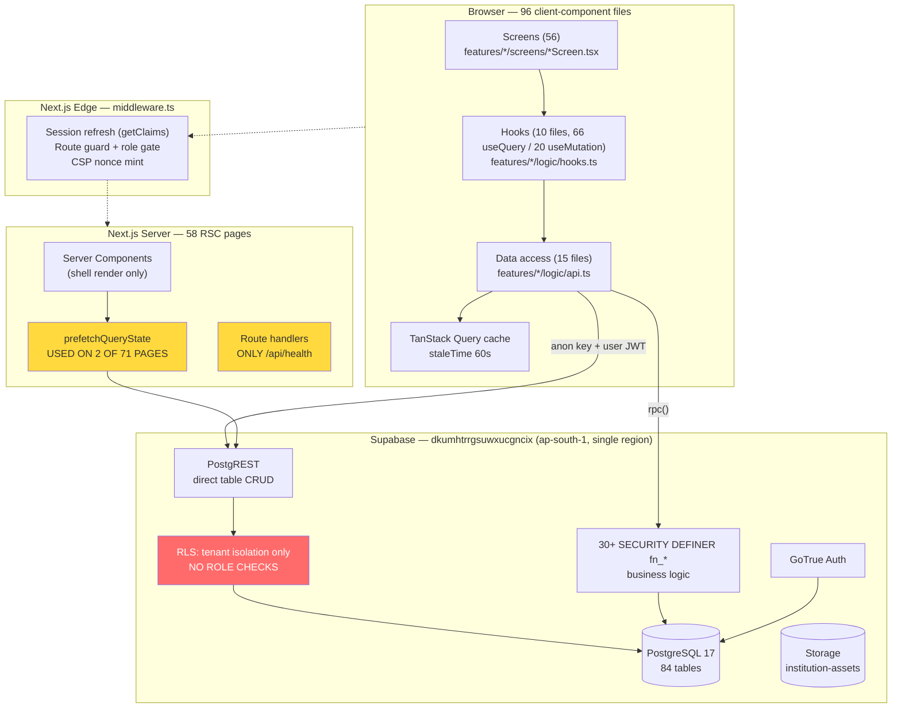

**Read the red box.** Every arrow from the browser terminates at a policy layer that checks *which school you belong to* and nothing else.

### What this architecture gets right

- Business logic that must be transactional is in the database, where transactions are. `fn_collect_fee`, `fn_run_migration`, `fn_process_exam_result` are atomic by construction — you cannot half-collect a fee.
- The client never composes multi-statement writes. Every mutation is one RPC call.
- RLS is defense-in-depth *underneath* the middleware gate, not instead of it.

### What it gets wrong

- It assumes RLS is a complete authorization layer. It is a complete *tenancy* layer. Those are different, and the gap is the whole of RBAC.
- It has no tier at which to put anything that is neither "a React render" nor "a SQL statement": rate limits, webhook receipt, retries, scheduled work, third-party calls, long-running batches.

## 3.2 Recommended architecture

The correct move is **not** a rewrite. It is **two additions and one closure**:

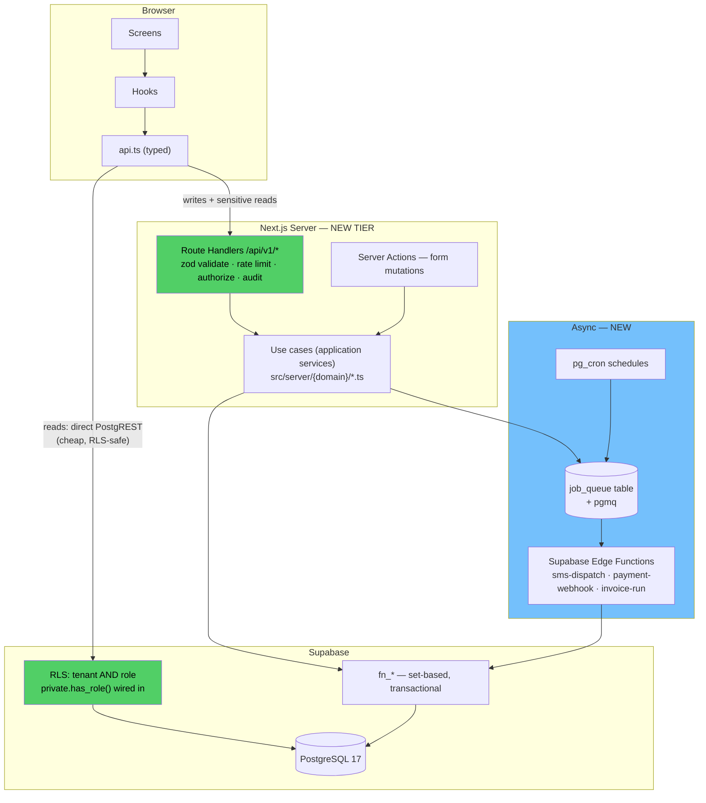

**The three changes:**

1. **Close the authorization gap in the DB** (§5.2). Non-negotiable, and it is the cheapest of the three.
2. **Add `src/server/` — a thin application-service tier.** Route handlers for writes and sensitive reads; plain functions (use cases) underneath. Reads that are already safe under RLS keep going direct — do not proxy 65 queries through Next just for symmetry. That would add a network hop and buy nothing.
3. **Add an async tier.** Supabase Edge Functions + a `job_queue` table + `pg_cron`. This is where SMS dispatch, payment webhooks, monthly invoice generation, and whole-school migration belong. Today they have nowhere to live, which is *why* SMS and payments were never finished.

## 3.3 Clean Architecture compliance

| Rule | Status | Evidence |
|---|---|---|
| Dependencies point inward | ⚠️ **Partial** | UI → hooks → api is clean. But `api.ts` depends directly on the Supabase concrete client (`BrowserClient`) — the infrastructure detail leaks into what should be the use-case boundary |
| Entities independent of frameworks | ❌ | There are no domain entities. Types are per-screen response shapes (`StudentBasic`, `FeeMappingRow`, `UnpaidStudent`) — DTOs, not a domain model. `Student` means something different in five files |
| Use cases independent of UI | ⚠️ **Partial** | Use cases exist, but in two disconnected places: PL/pgSQL `fn_*` and TS `api.ts`. Neither is complete on its own |
| Framework at the edge | ✅ | Next.js confined to `app/`; `features/` is framework-light |
| Testable without infrastructure | ❌ | `api.ts` functions take a live `BrowserClient`. The 2 api tests test *parsing helpers*, not the functions |

**Honest verdict: this is a good three-layer architecture, not Clean Architecture — and that is the right choice for a 21k-LOC product.** Full Clean Architecture here would mean repository interfaces, mappers, and DI containers wrapping a database you already control end to end. That is ceremony, not safety. **Take one thing from Clean Architecture and skip the rest:**

> **Adopt: a shared domain-type module** (`src/shared/domain/`) so `Student`, `Enrollment`, `Invoice` mean one thing system-wide.
> **Skip: repository interfaces, DI containers, ports/adapters.** You have one database and will have one database. An interface with one implementation is a liability, not an abstraction.

## 3.4 Domain boundaries

Nine bounded contexts are visible in the schema and mirrored in the feature tree — a strong sign the modelling was done deliberately:

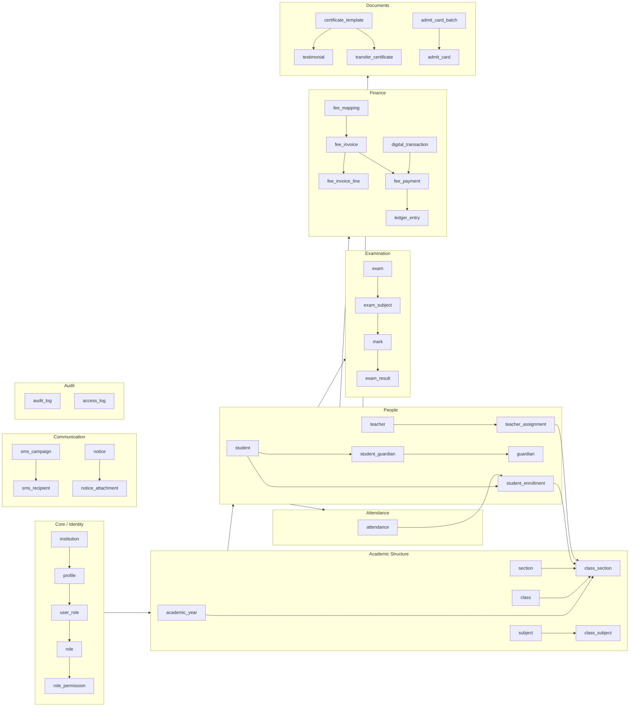

**A-M6 (M) — the aggregate root for enrollment is ambiguous.** `student.current_enrollment_id` points forward to `student_enrollment`, and `student_enrollment.student_id` points back. A bidirectional 1:1 with no single writer means two places can disagree about which enrollment is current. `fn_run_migration` maintains both sides correctly today — but nothing *enforces* that a future writer will. Either make `current_enrollment_id` a generated/trigger-maintained column, or replace it with a partial unique index on `student_enrollment (student_id) where status = 'active' and deleted_at is null` and drop the denormalised pointer.

## 3.5 Module separation & feature-based organization

Already correct. `features/admin/{attendance,certificate,core,dashboard,exam,fee,sms-notice,student,teacher}` with per-module `logic/`, and `features/{auth,parent}` alongside. One improvement worth making:

**A-L1 (L) — `features/admin/` is a role, not a domain.** The nesting is `features/admin/fee/...`, which means the day a *teacher* role needs the fee module, either the module moves or the boundary rule is weakened. Since `middleware.ts:18` already admits `teacher` into `/admin/*` as a fallback, this is not hypothetical. Flatten to `features/fee/`, `features/exam/`, and let `app/(admin)`, `app/(teacher)`, `app/(parent)` compose them. Cost: a mechanical move. Benefit: role changes stop being architecture changes.

---

# 4. Performance Optimization

## 4.1 Verified performance posture

Credit where due — the two largest latency wins are already in place and correctly reasoned:

- ✅ `getClaims()` instead of `getUser()` in middleware — local ES256 verification against cached JWKS instead of a ~150ms (p99 ~870ms) auth round-trip **on every request**.
- ✅ `staleTimes.dynamic: 30` — restores the client router cache for dynamic routes, removing 150–370ms + a skeleton flash from every back-navigation.
- ✅ Public routes short-circuit before any Supabase work (`middleware.ts:61-65`).

What follows is what is left.

## 4.2 API performance

**A-H4 (H) — 51 of 65 queries are unbounded.**

65 `.select()` calls; only 14 carry `.range()` or `.limit()`. Representative:

```ts
// src/features/admin/student/logic/api.ts:211-217 — every completed migration batch, ever
.from("migration_batch").select(...).eq("status","completed").order("created_at",{ascending:false})

// src/features/admin/fee/logic/api.ts:33-35 — every fee mapping in the institution
.from("fee_mapping").select("id, amount, ..., class:class_id(...), head:fee_head_id(name), ...")

// src/features/admin/fee/logic/api.ts:83-86 — every invoice for a student, all lines, all heads
.from("fee_invoice").select("..., lines:fee_invoice_line(amount, head:fee_head_id(name))")
```

At demo scale this is invisible. At a 2,000-student school after three years: `migration_batch` ≈ 300 rows × nested joins, `fee_invoice` per student ≈ 36 rows × lines. At a 500-school platform, the transfer volume becomes the dominant cost of the product.

The codebase **already knows this failure mode** — `fee/logic/api.ts:105-113` documents a bug where PostgREST's `db-max-rows` cap silently truncated results and the fee screen under-reported debt. That analysis is correct and was applied to *one* function. It applies to fifty.

> **Fix:** default every list query to `.range(0, 49)` with a `count: "exact"` head request, and drive it from the existing `shared/ui/Pagination` component (already built, already tested). Any query that legitimately needs the full set moves to a server-side aggregate RPC.

**A-M7 (M) — 13 of 30 cache invalidations are namespace-wide.**

```ts
// src/features/admin/fee/logic/hooks.ts:41-44
onSuccess: () => {
  qc.invalidateQueries({ queryKey: ["fee"] });        // invalidates ALL 11 fee queries
  qc.invalidateQueries({ queryKey: ["dashboard"] });
}
```

Collecting one student's fee marks fee heads, accounts, mappings, every student's invoices, both unpaid reports, the digital transaction list and stats, and the income statement as stale. Every one of those that is mounted refetches. **This is the most likely direct cause of "APIs are not performing smoothly"** — it is not that any single request is slow, it is that one click fires eight.

> **Fix:** invalidate the specific keys a mutation actually affects. `collectFee` touches that student's invoices, the two unpaid reports, and the dashboard — not the fee-head reference list, which has a 5-minute `staleTime` for exactly this reason.

**A-M8 (M) — the query-key factory is bypassed by 84% of queries.**

`shared/services/queryKeys.ts` is a well-designed factory with an excellent comment explaining why it must stay server-safe. It is imported at 17 sites. There are **89 raw inline `queryKey: [...]` arrays**. So the "single source of truth" is not one, and the prefetch contract ("`key` must be byte-identical to the hook's key") is enforced only by discipline for 84% of queries — with a *runtime* assert as the only backstop.

## 4.3 Database queries

**A-H5 (H) — `attendance` and `mark` are unpartitioned and will be the largest tables by an order of magnitude.**

At the stated target (100,000 students):

| Table | Annual growth | 3-year size |
|---|---|---|
| `attendance` | 100k students × ~220 school days = **22M rows/yr** | **66M** |
| `mark` | 100k × ~10 subjects × 4 exams = **4M rows/yr** | 12M |
| `fee_invoice` | 100k × 12 = 1.2M/yr | 3.6M |

`ix_attendance_cs_date (institution_id, class_section_id, att_date)` keeps point queries fast, but a 66M-row table means: vacuum pressure, index bloat, slow `ANALYZE`, and a `v_attendance_trend` view that aggregates across all of history with no time bound.

> **Fix:** `RANGE` partition `attendance` and `mark` by `academic_year_id` (not by date — the domain's natural boundary is the school year, and it makes archival a `DETACH PARTITION`). Do this **before** the first large tenant, because partitioning a live 20M-row table is a maintenance window you will not want.

**A-M9 (M) — missing composite index for the dashboard's month-to-date sum.**

`v_dashboard_kpi` computes `collected_this_month` as:

```sql
select coalesce(sum(amount),0) from fee_payment fp
 where fp.institution_id = i.id and fp.paid_at >= date_trunc('month', now())
```

`fee_payment` has only `ix_fee_payment_institution (institution_id)`. Postgres will scan every payment the school has ever taken and filter by date in memory — on the first screen every admin loads.

> **Fix:** `create index ix_fee_payment_inst_paid on fee_payment (institution_id, paid_at) include (amount);`

**A-M10 (M) — soft delete is pervasive but unindexed.** `is("deleted_at", null)` filters appear throughout `api.ts`, and the partial *unique* indexes correctly use `where deleted_at is null` — but no *lookup* index does. On `student` and `fee_invoice` this makes every list query read deleted rows and discard them. Add `where deleted_at is null` to the hot composite indexes.

**A-L2 (L) — `v_dashboard_kpi` recomputes 5 aggregates per page load.** Acceptable per-tenant today. At 500 schools with frequent dashboard use, promote to a materialised rollup refreshed by `pg_cron` every 5 minutes, or memoise behind a 60-second RPC cache. Not urgent; note it.

## 4.4 Rendering performance

**A-M11 (M) — zero code splitting.** `grep -rn "next/dynamic\|React.lazy" src/` → **0 results**. `.next/static` is 15 MB. Everything a user could possibly reach ships in the initial route graph — including `Chart.tsx` (only the dashboard and 2 report screens use it), `Dialog.tsx`, and the certificate/ID-card renderers.

> **Fix (cheap, high value):** `next/dynamic` with `ssr: false` on `BarChart`/`Donut`, the certificate preview renderers, and `MigrationRunner`. Three imports, measurable first-load reduction — this matters specifically for the rural-Bangladesh connections the codebase's own comments cite as the design constraint.

**A-M12 (M) — server-side prefetch is used on 2 of 71 pages.** `prefetchQueryState` is a well-built, correctly-asserted mechanism that eliminates the third sequential round-trip on first paint. It is deployed on **two** pages. The comment says roll-out is intentionally incremental — that was right in July; it is now the largest unclaimed first-paint win in the product. Prioritise the 10 highest-traffic screens (dashboard, student list, teacher list, attendance section, fee collection).

**A-L3 (L) — 203 `useState` / 51 `useEffect` / 23 memoizations.** Ratio suggests avoidable re-render cascades in the larger screens (`OverviewScreen` 385 LOC, `TeacherForm` 422 LOC, `RegistrationScreen` 306 LOC). Not a measured problem; profile before optimising.

## 4.5 Caching, memory, network — summary

| Layer | Present | Gap |
|---|---|---|
| Client router cache | ✅ 30s dynamic / 300s static | — |
| TanStack Query | ✅ 60s stale, focus-refetch off, retry 1 | Over-invalidation (**A-M7**) |
| RSC prefetch | ⚠️ built | 2/71 pages (**A-M12**) |
| HTTP cache headers | ❌ | Everything dynamic; no `Cache-Control` on reference data |
| CDN / edge cache | ❌ | Reference tables (`division`, `district`, `upazila` — 494 upazilas, immutable) are fetched per session |
| DB result cache | ❌ | No materialised views (**A-L2**) |
| Bundle | ❌ | No splitting (**A-M11**), full barrel (**A-M4**) |
| Background processing | ❌ | **Nothing** (**A-H7**) |

**Immutable reference data (`division`, `district`, `upazila`, `enum_label`) is fetched through PostgREST with an RLS check on every session.** These change never. Ship them as a static JSON import or cache them at the edge with a long `s-maxage`.

## 4.6 Background processing — the missing tier

**A-H7 (H) — there is no asynchronous execution anywhere in the system.**

`ls supabase/functions` → does not exist. No Edge Functions, no `pg_cron`, no queue, no worker. Consequences:

| Operation | Today | At scale |
|---|---|---|
| Year-end migration | `fn_run_migration` — **row-by-row PL/pgSQL loop**, synchronous inside one PostgREST request | A 1,200-student school promoted section-by-section = 30 sequential requests; a whole-school call exceeds the `authenticated` statement timeout and **rolls back after the operator has waited** |
| Bulk SMS | `fn_send_sms_campaign` inserts campaign + recipient rows synchronously | 5,000 recipients = 5,000 inserts in one request; no retry, no delivery-receipt path |
| Result processing | `fn_process_exam_result` — 4 CTEs + a ranking `UPDATE` over all marks for the exam | Correct and set-based ✅, but still synchronous; a 2,000-student exam is a long-held transaction |
| Monthly invoice generation | **Does not exist** | Must be a scheduled job; there is nowhere to put one |
| Payment webhook | **Does not exist** | bKash/Nagad callbacks have no endpoint to hit |

> **Fix:** rewrite `fn_run_migration`'s loop as a set-based `INSERT ... SELECT` (it is expressible — the roll-number assignment is a `row_number() over (order by merit_rank)`), and add the async tier from §3.2. Both are prerequisites for the second and third bullets ever being finishable.

---

# 5. Security Review

## 5.1 What is already correct

- ✅ `force row level security` on **all 84 tables** (not just `enable` — the table owner is subject to it too).
- ✅ Every `SECURITY DEFINER` function has `set search_path = ''` — no search-path hijack.
- ✅ RPCs revoked from `anon` and `public`, granted only to `authenticated`/`service_role`. The prior audit's anon-executable-RPC hole is closed (migration 34). ✅
- ✅ Per-request CSP with a nonce; `script-src` never needs `unsafe-inline` (`middleware.ts:35-37`, `shared/services/csp.ts`).
- ✅ HSTS preload, `X-Frame-Options: DENY`, `nosniff`, `Referrer-Policy`, `Permissions-Policy` (`next.config.mjs`).
- ✅ Middleware **fails closed in production** when Supabase env is missing (`middleware.ts:42-49`).
- ✅ Private storage bucket with per-tenant policies (migration 28).
- ✅ `private` schema is not in PostgREST's exposed schemas — helpers are off-API.
- ✅ Next.js at `^15.5.21` — CVE-2025-29927 (middleware auth bypass) is remediated. ✅
- ✅ CI gates on `npm audit --omit=dev`.

That is a serious security baseline. Which makes the next two findings more surprising, not less.

## 5.2 A-C1 (CRITICAL) — The database has no role-based authorization

**Location:** `supabase/migrations/20260711034924_06_rls_policies.sql` — all policies
**Corroborating:** `supabase/migrations/20260711034734_05_functions_triggers.sql:13-30`

Every policy in the system has this shape:

```sql
create policy tenant_isolation on public.<table> for all to authenticated
  using (institution_id = (select private.current_institution_id())
         or (select private.is_platform_admin()))
  with check (...same...);
```

`for all` = SELECT + INSERT + UPDATE + DELETE. `to authenticated` = **every logged-in human**. The only discriminator is *which institution you belong to*.

Meanwhile, `05_functions_triggers.sql` defines exactly the helpers this needs — and **not one policy calls them**:

```sql
create or replace function private.has_role(role_code text) returns boolean ...          -- 0 policy references
create or replace function private.can_access_class_section(cs_id uuid) returns boolean  -- 0 policy references
```

Both are `grant execute ... to authenticated`. Both are dead. The RBAC *schema* is fully modelled — `role`, `user_role`, `permission`, `role_permission` all exist with their own policies — and it is enforced nowhere.

### Why this is exploitable, not theoretical

The browser holds the Supabase anon key and the user's JWT, and talks to PostgREST **directly** (`shared/services/supabase/client.ts`). There is no server tier in between (§3.1). So any authenticated user can open DevTools and issue arbitrary PostgREST calls with their own session. A **parent** — who has a real GoTrue account and reaches `/parent` — can run:

| Call | Result today |
|---|---|
| `supabase.from('student').select('*')` | Every student in the school: names, DOB, birth registration numbers, addresses, guardians' phone numbers. **Personal data of minors.** |
| `supabase.from('mark').update({marks_obtained: 100}).eq('student_id', myChild)` | **Grade tampering.** |
| `supabase.from('fee_invoice').update({due_amount: 0})` | **Fee erasure.** |
| `supabase.from('teacher').select('*')` | Staff salary/employment records |
| `supabase.from('audit_log').delete().neq('id', ...)` | **Erase the evidence** (see A-H6) |
| `supabase.from('user_role').insert({...})` | Grant themselves any role in the tenant |

A **teacher** has the same reach across all classes, not just their own — which is precisely what `can_access_class_section()` was written to prevent, and precisely what it does not prevent because nothing calls it.

The middleware role gate (`middleware.ts:80-97`) stops a parent from *loading the admin UI*. It does not stop a parent from *calling the API*, because the API is the database and the database does not check roles.

### Remediation (6–8 days, do this first)

**Step 1 — a permission helper (½ day):**

```sql
create or replace function private.has_permission(p_code text) returns boolean
  language sql stable security definer set search_path = '' as $$
  select private.is_platform_admin() or exists (
    select 1 from public.user_role ur
    join public.role_permission rp on rp.role_id = ur.role_id
    join public.permission p on p.id = rp.permission_id
    where ur.profile_id = (select auth.uid()) and p.code = p_code
  )
$$;
grant execute on function private.has_permission(text) to authenticated;
```

**Step 2 — split `for all` into verb-specific policies (4 days).** Replace the single generated policy with a generated *pair* per table:

```sql
-- read: tenant + read permission
create policy read_<t> on public.<t> for select to authenticated
  using (institution_id = (select private.current_institution_id())
         and (select private.has_permission('<domain>.read')));

-- write: tenant + write permission (INSERT/UPDATE/DELETE separately where they differ)
create policy write_<t> on public.<t> for all to authenticated
  using (institution_id = (select private.current_institution_id())
         and (select private.has_permission('<domain>.write')))
  with check (institution_id = (select private.current_institution_id())
         and (select private.has_permission('<domain>.write')));
```

Keep the `(select ...)` wrapping — the existing policies get this right and it is what keeps RLS from re-evaluating the helper per row.

**Step 3 — wire `can_access_class_section()` on `attendance`, `mark`, `student_enrollment` (1 day)** so a teacher sees their sections, not the school.

**Step 4 — parent scoping (1 day).** Parents get read-only policies restricted to their linked children via `student_guardian`:

```sql
create policy parent_read_own_children on public.mark for select to authenticated
  using (exists (select 1 from public.student_guardian sg
                 join public.profile pr on pr.linked_guardian_id = sg.guardian_id
                 where pr.id = (select auth.uid()) and sg.student_id = mark.student_id));
```

**Step 5 — pgTAP policy tests (1–2 days).** For each role × table × verb, assert the expected allow/deny. **This is the deliverable that makes the fix defensible in your viva**: "we do not merely claim parents cannot edit marks — here is the test that fails if they can."

## 5.3 A-C2 (CRITICAL) — Role is read from client-writable `user_metadata`

**Locations (4):**
- `src/shared/services/supabase/middleware.ts:59`
- `src/middleware.ts:78` *(the comment)*
- `src/app/(auth)/login/page.tsx:61`
- `src/app/page.tsx:21`

```ts
role: (claims.app_metadata?.role ?? claims.user_metadata?.role) as string | undefined
```

In Supabase, `app_metadata` is service-role-only. **`user_metadata` is writable by the user themselves** via `supabase.auth.updateUser({ data: { role: 'super_admin' } })` — that is its documented purpose.

So for any account where `app_metadata.role` is null or absent, the `??` falls through to a value the account holder controls. That user then satisfies `ADMIN_ROLES.has(role)` at `middleware.ts:84` and is routed into `/admin/*`.

**Combined with A-C1, this is a complete privilege escalation:** the fallback gets them into the admin UI, and the missing role policies mean the admin UI's every API call succeeds.

And `src/middleware.ts:78` states:

> `// JWT (app_metadata), so it can't be tampered client-side.`

**That comment is false as written.** In a codebase where comments are otherwise this reliable, a false safety claim is worse than no comment — it is the thing a reviewer trusts instead of reading the code.

### Remediation (30 minutes)

Delete the fallback at all four sites:

```ts
role: claims.app_metadata?.role as string | undefined
```

Then verify no account depends on it:

```sql
select id, email from auth.users
where (raw_app_meta_data->>'role') is null;   -- must return 0 rows
```

Backfill any that do via a service-role script, and correct the comment. Add a middleware test asserting a `user_metadata`-only role is rejected — `tests/middleware.test.ts` already exists and is the right home.

## 5.4 A-H6 (HIGH) — The audit log is incomplete and self-erasable

**Locations:** `05_functions_triggers.sql:69-75`, `06_rls_policies.sql:86`

**Coverage — 6 of 84 tables:**

```sql
foreach t in array array['mark','exam_result','fee_invoice','student_enrollment','migration_batch','setting']
```

**Not audited:** `fee_payment` (actual money movement), `student`, `teacher`, `guardian`, `profile`, `user_role`, `role_permission` (privilege changes), `institution`, `sms_campaign`, `certificate_template`, `testimonial`, `transfer_certificate`.

That an *invoice* is audited but the *payment against it* is not is exactly backwards: the invoice is a claim, the payment is the cash.

**Integrity:**

```sql
create policy audit_policy on public.audit_log for all to authenticated
```

`for all` includes `DELETE`. **Any authenticated user in the tenant can delete their own audit trail.** An audit log the audited party can erase provides no assurance whatsoever — and note that `src/features/admin/core/screens/audit-log/` renders it, so the UI presents it as a control.

### Remediation (½ day)

```sql
-- 1. Append-only: read for the permitted, insert only by the trigger, never update/delete.
drop policy audit_policy on public.audit_log;

create policy audit_read on public.audit_log for select to authenticated
  using (institution_id = (select private.current_institution_id())
         and (select private.has_permission('audit.read')));
-- No INSERT/UPDATE/DELETE policy at all: the SECURITY DEFINER trigger bypasses RLS to write,
-- and with no policy granting them, no client can ever modify a row.

-- 2. Extend coverage to everything that moves money, people, or privilege.
do $$ declare t text; begin
  foreach t in array array['fee_payment','digital_transaction','ledger_entry','student','teacher',
                           'guardian','profile','user_role','role_permission','institution',
                           'certificate_template','testimonial','transfer_certificate','sms_campaign']
  loop
    execute format('create trigger trg_audit_%1$s after insert or update or delete on public.%1$s
                    for each row execute function private.audit_trigger();', t);
  end loop;
end $$;
```

**Then set a retention policy** — `audit_log` on `attendance`-adjacent tables grows fast, and Bangladeshi education-sector record-keeping norms plus general data-minimisation both argue for a defined horizon (suggest 7 years for finance/results, 1 year for the rest, enforced by a `pg_cron` partition drop).

## 5.5 A-H8 (HIGH) — No application-level rate limiting

The only rate limiting in the system is **Supabase GoTrue's own throttling on `/auth/v1/token`**, which the login screen correctly detects and reports (`errors.ts` maps `over_request_rate_limit` → `rate_limited`; tested in `errors.test.ts:44-48`). That is good handling of a limit you did not implement.

There is no limit on anything else. Because the client calls PostgREST directly, an authenticated user can issue unlimited queries — and combined with A-H4 (unbounded selects), a single scripted loop can pull the school's entire dataset or exhaust the connection pool. There is also no protection on the SMS send path, which spends real money per message.

**Remediation:** rate limiting requires the server tier from §3.2. Route the write path and the SMS path through `/api/v1/*` handlers with a token-bucket in Postgres (`request_log` + a `check_rate_limit()` function) or Upstash. Until that tier exists, set Supabase's per-project API rate limits and the `authenticated` role's `statement_timeout` down from the default as a stopgap.

## 5.6 Input validation

**Good, with one gap.** Zod schemas guard every RPC payload (`studentBasicSchema`, `runMigrationSchema`, `feeMappingSchema`, `collectPayloadSchema`), and the reasoning behind each rule is documented — `student/logic/api.ts:63-71` explains why `dob` is the field that matters, and `:134-145` explains why migration needs `students.min(1)` and source ≠ target. The PL/pgSQL functions re-validate independently (`raise exception 'no institution context'`). Defense in depth, done right.

**A-M13 (M) — validation errors lose their field.** `grep "safeParse\|\.parse(" src/features/**/*.tsx` → **0**. Schemas are only invoked inside `api.ts`, so a `ZodError` propagates to `classifyError`, which flattens it to the `"invalid"` kind (`errors.ts:75`) and the user gets one generic toast. On a 20-field student registration form, "invalid input" is not an actionable message.

> **Fix:** call `schema.safeParse()` in the screen before mutating, and map `error.issues[].path` to per-field messages. `shared/ui/Form.tsx`'s `Field` already accepts an error prop.

## 5.7 Secrets management

- ✅ Only `NEXT_PUBLIC_*` keys in `.env.local` and CI — no service-role key anywhere in the repo or client bundle. Correct.
- ✅ CI stores publishable keys in repo secrets so fork PRs never build against the real project. Thoughtful.
- ⚠️ **`.env.local` is present in the working tree.** `.gitignore` covers it, but confirm it was never committed: `git log --all --full-history -- .env.local`.
- ❌ **No secret rotation procedure.** When the server tier lands and a service-role key exists, this becomes mandatory. Document it in `RUNBOOK.md` now.

## 5.8 Security scorecard

| Control | Status |
|---|---|
| Authentication (GoTrue, ES256, HttpOnly cookies) | ✅ Strong |
| **Authorization — tenant** | ✅ **Excellent** |
| **Authorization — role** | ❌ **Absent (A-C1)** |
| Session management (edge refresh, fail-closed prod) | ✅ Strong |
| Role integrity in JWT | ❌ **Broken (A-C2)** |
| API security (RLS + revoked anon RPCs) | ⚠️ Tenant-only |
| Database hardening (`force RLS`, `search_path=''`) | ✅ Excellent |
| Input validation | ✅ Good (field-level UX gap) |
| Secrets | ✅ Good (no rotation policy) |
| Rate limiting | ❌ Auth endpoint only (A-H8) |
| Audit logging | ⚠️ 7% coverage, deletable (A-H6) |
| Transport / headers / CSP | ✅ Excellent |
| Dependency hygiene | ✅ CI-gated |

---

# 6. Scalability Review

## 6.1 Target vs. capability

| Target | Verdict | Binding constraint |
|---|---|---|
| **Hundreds of schools** | ⚠️ **Conditional** | Tenancy model is correct and RLS is complete. Blocked only by A-C1 — you cannot onboard a second real school while every user can read the whole tenant |
| **Thousands of teachers** | ⚠️ **Conditional** | Teachers have no scoping (`can_access_class_section` unused). Functionally fine, security-wise wrong |
| **Hundreds of thousands of students** | ❌ **No** | A-H4 (unbounded queries) + A-H5 (unpartitioned attendance/mark) |
| **Millions of records** | ❌ **No** | A-H5 + A-H7 (no async tier for bulk work) |

## 6.2 Tenancy model — the good news

Single-database, shared-schema, `institution_id`-scoped with RLS. For 100–500 schools this is the **right** choice: one schema to migrate, one connection pool, one backup, and per-tenant isolation enforced by the database rather than by application code that can forget. The index design supports it (`institution_id` leftmost everywhere).

**Where it breaks:** a single Supabase instance in one region (`ap-south-1`). Beyond ~500 schools or if a large district demands data residency, you need tenant sharding. The good news is the schema is already shard-ready — `institution_id` is the natural shard key and appears on every table. Plan for it; do not build it now.

## 6.3 Growth model

At **500 schools × 400 students**= 200,000 students:

| Table | 1 yr | 3 yr | Concern |
|---|---|---|---|
| `attendance` | 44M | **132M** | **Must be partitioned** |
| `mark` | 8M | 24M | Should be partitioned |
| `student_enrollment` | 200k | 600k | Fine |
| `fee_invoice` | 2.4M | 7.2M | Fine with indexes |
| `fee_payment` | 2.4M | 7.2M | Needs A-M9 index |
| `audit_log` | — | unbounded | **Needs retention policy** |
| `sms_recipient` | ~10M | 30M | Needs archival |

## 6.4 Scalability action list

| # | Action | Blocks | Effort |
|---|---|---|---|
| 1 | Role-based RLS (**A-C1**) | Any multi-school deployment | 6–8 d |
| 2 | Partition `attendance`, `mark` by `academic_year_id` | 100k+ students | 2–3 d |
| 3 | Pagination on all 51 unbounded queries | 2k+ students/school | 3–4 d |
| 4 | Async tier: Edge Functions + `pg_cron` + job table | Bulk SMS, invoices, migration | 4–5 d |
| 5 | Set-based rewrite of `fn_run_migration` | Whole-school promotion | 1 d |
| 6 | Retention + archival for `audit_log`, `sms_recipient`, `access_log` | 3-yr storage cost | 1 d |
| 7 | Connection pooling review (PgBouncer transaction mode) | 500+ concurrent | ½ d |
| 8 | Read replica for reports/analytics | Report load isolation | 1 d |

---

# 7. Blind Spots and Hidden Risks

These are the findings that no bug report will ever surface, because nothing is currently broken.

## 7.1 A-H9 (HIGH) — Three subsystems are UI without implementation

The most consequential blind spot in the project: **screens that look finished and do nothing.**

**1. The entire parent portal is hardcoded.** `grep -rl "useQuery\|useMutation" src/features/parent src/app/\(parent\)` → **0 files**. Every one of the 6 parent screens renders literals:

```tsx
// src/app/(parent)/parent/results/page.tsx:12-19
const SUBJECTS: Subject[] = [
  { bn: "বাংলা", en: "Bangla", marks: 82, grade: "A+" },
  ...
];
```

Every parent, in every school, sees a GPA of the same fictional student. In a defense demo this will be shown as a working feature.

**2. SMS is never sent.** `fn_send_sms_campaign` (migration 25) inserts into `sms_campaign` and `sms_recipient`, decrements the SMS balance, and returns. There is **no provider integration** — no `fetch`, no Edge Function, no outbound HTTP anywhere in the repository. The system charges the school's SMS balance for messages that do not exist, and `v_sms_campaign_summary` will report `delivered = 0` forever because nothing ever sets that status.

**3. Digital payment has no gateway.** `bkash`/`nagad` appear only as enum values in `shared/constants/enums.ts` and the schema. There is no gateway SDK, no webhook endpoint, no signature verification, no reconciliation job. `DigitalCollectionScreen` records a transaction ID an operator types by hand. **That is not a payment integration; it is a manual ledger with a payment-shaped UI** — and it will silently accept a fabricated transaction ID.

> **This is a scope-honesty risk, not just an engineering one.** Either finish them or label them clearly in the demo and the report. A panel that discovers a hardcoded GPA mid-demo will discount everything else you built — including the parts that are genuinely excellent.

## 7.2 A-M14 (M) — Nothing tests what matters most

11 test files against 247 sources. The *selection* is smart — the architecture invariant, the middleware gate, the prefetch key contract, money-string parsing. But:

- **Zero RLS/policy tests.** The security model is 100% RLS and 0% tested. A-C1 existed for months undetected precisely because nothing asserts "a parent cannot select from `student`."
- **Zero E2E.** No test walks login → dashboard → collect fee → verify ledger.
- **Zero load tests.** Every scalability claim in this document (and yours) is a projection.
- **Zero migration tests.** 35 migrations, never verified to apply cleanly from empty.

The single highest-value test to write, today: **pgTAP RLS assertions.** They directly encode the fix for A-C1, they run in CI, and they are the artefact that turns "we secured it" into "here is the proof."

## 7.3 A-M15 (M) — Disaster recovery is untested

`RUNBOOK.md` exists ✅ and migrations are in VCS ✅ (both prior-audit fixes landed). Remaining:

- **No restore has ever been performed.** A backup you have not restored from is a hypothesis.
- **Single region** (`ap-south-1`). No cross-region replica.
- **No RPO/RTO defined.** For a school system, marks and fee ledgers during exam/admission season are the critical windows — a 24h RPO in November is very different from one in June.
- **No `supabase db diff` in CI.** The README says the repo matches the hosted project; nothing enforces it, and someone will eventually apply DDL by hand.

> **Fix:** add `supabase db diff --linked` to CI as a non-blocking drift check; schedule one quarterly restore drill into a scratch project and record the wall-clock RTO in the runbook.

## 7.4 A-M16 (M) — The academic year is an implicit global

`academic_year` has `uq_year_current ... where is_current` — exactly one current year per institution. But most `api.ts` queries never filter by year (`fetchFeeMappings`, `fetchMigrationBatches`, `fetchStudentInvoices`). They work today because there is one year of data. **In year two, every unfiltered list silently doubles**, and reports start mixing years without any error. This will be discovered by a school, in production, at the worst possible time.

> **Fix:** make the academic year an explicit parameter on every year-scoped query, sourced from one context provider. Do it before the first tenant rolls over — retrofitting after is a data-correctness incident, not a refactor.

## 7.5 Additional risks

| ID | Risk | Sev |
|---|---|---|
| A-M17 | **Bus factor 1.** Single-developer commit history; ADRs and comments mitigate but do not remove | M |
| A-M18 | **`profile` ↔ `institution_id` is the root of all RLS.** If `handle_new_auth_user()` fails to set it, `current_institution_id()` returns null and the user sees *nothing* — a confusing silent-empty state with no diagnostic | M |
| A-M19 | **No feature flags.** Every deploy is all-or-nothing across all tenants | M |
| A-M20 | **No uptime/SLO monitoring.** `/api/health` exists ✅ but nothing polls it and no alert fires | M |
| A-L4 | **No i18n fallback path.** `useT(bn, en)` requires both strings at every call site; a missed translation is invisible until a Bangla-only user hits it | L |
| A-L5 | **`.next/` build artefacts and `tsconfig.tsbuildinfo` in the working tree** — confirm gitignored | L |

---

# 8. Enterprise Best Practices

## 8.1 What to adopt — and, equally, what to skip

A 21k-LOC product with one database and one team does not need the full enterprise pattern catalogue. Applying all of it would make this codebase *worse*. Here is the honest split:

| Pattern | Verdict | Rationale |
|---|---|---|
| **Clean Architecture (full)** | ❌ **Skip** | Repository interfaces + mappers + DI over a database you control end-to-end is ceremony. You would write 2,000 lines to abstract a dependency you will never swap |
| **Shared domain types** | ✅ **Adopt** | The one Clean Architecture idea that pays here — §8.2 |
| **DDD bounded contexts** | ✅ **Already have them** | Formalise the boundaries you drew; do not add aggregates/repositories/domain events |
| **SOLID — SRP, DIP** | ✅ Adopt selectively | §8.3 |
| **SOLID — LSP, ISP** | ➖ N/A | Almost no inheritance or interface hierarchies in this codebase. Good |
| **DRY** | ⚠️ Apply | 9× `RpcFn`, ~30 row-mappers, 9× form/dirty wiring |
| **KISS** | ✅ **Already the codebase's strongest habit** | Preserve it — resist the urge to "enterprise-ify" during remediation |
| **CQRS (full, with separate stores)** | ❌ **Skip** | You do not have the write volume. A second store means a sync problem you do not have today |
| **CQRS (read-model views)** | ✅ **Already doing it** | `v_dashboard_kpi`, `v_attendance_*`, `v_sms_campaign_summary` are read models. Extend this, not the pattern's full form |
| **Repository pattern** | ❌ **Skip** | `logic/api.ts` *is* your repository layer, and it is honest about being Supabase-specific. Wrapping it in an interface with one implementation adds a file per domain and zero safety |
| **Unit of Work** | ✅ **Already have it, better** | Postgres transactions inside `SECURITY DEFINER` RPCs are a stronger UoW than any ORM's. Keep multi-step writes in RPCs |
| **Dependency Injection** | ⚠️ **Partial — the good kind** | `api.ts` functions take `supabase` as a parameter. That is constructor injection, done in the simplest way that works. **Do not add a container** |
| **Event-Driven** | ✅ Adopt narrowly | §8.5 — outbox for SMS/payments only |

## 8.2 Shared domain types (adopt)

Today `Student` is `StudentBasic` in one file, `SectionStudent` in another, `UnpaidStudent` in a third — each a screen-shaped DTO. That is fine for *responses*; it is not fine as the system's vocabulary.

```
src/shared/domain/
  student.ts      # Student, Enrollment, Guardian + branded ids
  academic.ts     # AcademicYear, Class, Section, Subject
  finance.ts      # Invoice, Payment, Money (branded — never `number`)
  assessment.ts   # Exam, Mark, Result, GPA
```

Branded IDs and a `Money` type are worth it here specifically: this system moves money and computes grades, and `type StudentId = string & {__brand:'StudentId'}` makes "passed a section id where a student id was expected" a compile error. That bug class is otherwise invisible — every id is a UUID string.

## 8.3 SOLID — where it applies

**SRP — one violation worth fixing.** `logic/api.ts` currently does four jobs: query construction, response mapping, zod validation, and RPC invocation. Split within the same file (not into new layers):

```
logic/
  queries.ts    # PostgREST reads
  commands.ts   # RPC writes
  schemas.ts    # zod
  mappers.ts    # row → domain
```

**DIP — the one abstraction that earns its place.** `api.ts` depends on `BrowserClient`, a concrete Supabase type. Narrowing that to the *operations* used makes these functions unit-testable without a live database — which is the gate on ever testing them at all:

```ts
export type DataClient = Pick<BrowserClient, "from" | "rpc">;
```

One line. No container, no factory, no interface file per domain.

**OCP — already satisfied** by the generated-policy and generated-trigger `do $$` loops in SQL: adding a table extends behaviour without editing existing code.

## 8.4 DRY — the concrete targets

| Duplication | Count | Fix |
|---|---|---|
| `type RpcFn` + cast | 9 declarations, ~30 casts | One typed `callRpc()` in `shared/services/supabase/` — §8.6 |
| `((data ?? []) as unknown as Raw[]).map(...)` | ~30 | Generic `mapRows<TRaw, TOut>()` helper |
| Form state + dirty + SaveBar | 9 screens | One `useEntityForm()` hook |
| Inline `queryKey: [...]` | 89 | Extend `queryKeys.ts` to full coverage; lint-ban inline arrays |

## 8.5 Event-driven — narrowly

Do **not** put an event bus in front of this system. Do add a **transactional outbox** for the two operations that must reach the outside world reliably:

```sql
create table outbox (
  id uuid primary key default gen_random_uuid(),
  institution_id uuid not null,
  topic text not null,              -- 'sms.dispatch' | 'payment.verify'
  payload jsonb not null,
  status text not null default 'pending',
  attempts int not null default 0,
  created_at timestamptz not null default now(),
  processed_at timestamptz
);
```

`fn_send_sms_campaign` writes the outbox row **in the same transaction** as the campaign. A `pg_cron`-scheduled Edge Function drains it with retries. This gives at-least-once delivery, survives provider outages, and is roughly 100 lines total. That is the entire event-driven footprint this system needs.

## 8.6 The typed RPC helper (removes 9 duplications and restores type safety)

```ts
// src/shared/services/supabase/rpc.ts
import type { Database } from "@/shared/types/database.types";
import type { DataClient } from "./types";

type Fns = Database["public"]["Functions"];

/**
 * The single sanctioned RPC seam. Replaces nine hand-rolled `RpcFn` types and
 * ~30 `as unknown as` casts, and — the actual point — restores the RETURN type,
 * which the old pattern discarded to `unknown` and then re-cast by hand at
 * every call site.
 */
export async function callRpc<K extends keyof Fns & string>(
  db: DataClient,
  fn: K,
  args: Fns[K]["Args"],
): Promise<Fns[K]["Returns"]> {
  const { data, error } = await db.rpc(fn, args);
  if (error) throw error;              // classifyError() maps PG codes downstream
  return data as Fns[K]["Returns"];
}
```

Call sites shrink from three lines to one, and a typo in an RPC name or argument becomes a compile error instead of a runtime `PGRST202`.

---

# 9. Optimized Codebase Structure

**Design principle: evolve, do not rewrite.** ~80% of this tree already exists and is correct. `[NEW]` marks additions; `[MOVE]` marks relocations; everything unmarked stays exactly where it is.

```
EduFusionBD/
├── .github/workflows/
│   ├── ci.yml                          # ✅ typecheck → lint → test → build → audit
│   ├── db-drift.yml            [NEW]   # supabase db diff --linked (drift alarm, A-M15)
│   ├── e2e.yml                 [NEW]   # Playwright on PR
│   └── deploy.yml              [NEW]   # preview → staging → prod, migrations gated
│
├── docs/
│   ├── ARCHITECTURE_AUDIT.md           # this document
│   ├── ENGINEERING_AUDIT.md            # ✅ 2026-07-25, prod-readiness
│   ├── RUNBOOK.md                      # ✅ + restore drill, secret rotation, RPO/RTO
│   ├── adr/                            # ✅ 3 ADRs
│   │   ├── 0004-no-server-tier.md          [NEW] record the BaaS decision + its limits
│   │   ├── 0005-rbac-in-rls.md             [NEW] the A-C1 remediation decision
│   │   └── 0006-async-outbox.md            [NEW]
│   ├── design-system.md · component-library.md · ui-ux-audit.md   # ✅
│   └── THREAT_MODEL.md         [NEW]   # roles × assets × controls
│
├── supabase/
│   ├── config.toml
│   ├── migrations/                     # ✅ 35, in VCS, md5-verified
│   ├── functions/              [NEW]   # the missing async tier (A-H7)
│   │   ├── sms-dispatch/               #   drains outbox → provider
│   │   ├── payment-webhook/            #   bKash/Nagad callback + signature verify
│   │   ├── invoice-run/                #   monthly generation (pg_cron)
│   │   └── _shared/                    #   cors, auth, provider clients
│   ├── tests/                  [NEW]   # pgTAP — THE highest-value addition (A-M14)
│   │   ├── rls_tenant.sql              #   cross-tenant denial
│   │   ├── rls_roles.sql               #   parent/teacher/admin × table × verb
│   │   ├── rpc_authz.sql               #   anon cannot execute; tenant guards fire
│   │   └── audit_append_only.sql       #   audit_log cannot be deleted
│   └── seed/                   [MOVE]  # out of migrations 10/11 — seed ≠ schema
│
├── src/
│   ├── app/                            # ✅ routing + RSC only, no logic
│   │   ├── (admin)/ (auth)/ (parent)/  # ✅ + (teacher)/ when the role splits
│   │   └── api/
│   │       ├── health/route.ts         # ✅
│   │       └── v1/             [NEW]   # the server tier (§3.2)
│   │           ├── fees/collect/route.ts
│   │           ├── sms/send/route.ts
│   │           ├── students/migrate/route.ts
│   │           └── _lib/{withAuth,withRateLimit,withAudit,withValidation}.ts
│   │
│   ├── server/                 [NEW]   # application services — server-only
│   │   ├── fee/collectFee.ts           #   authorize → validate → rpc → audit → enqueue
│   │   ├── sms/sendCampaign.ts
│   │   ├── student/runMigration.ts
│   │   └── _kernel/{authorize,rateLimit,auditTrail}.ts
│   │
│   ├── features/                       # ✅ feature-sliced, boundary-enforced
│   │   ├── fee/                [MOVE]  # de-nest from admin/ (A-L1)
│   │   │   ├── screens/ components/
│   │   │   └── logic/
│   │   │       ├── queries.ts  [SPLIT] # was api.ts — SRP (§8.3)
│   │   │       ├── commands.ts [SPLIT]
│   │   │       ├── schemas.ts  [SPLIT]
│   │   │       ├── mappers.ts  [SPLIT]
│   │   │       ├── keys.ts     [NEW]   # feature's slice of queryKeys (A-M8)
│   │   │       └── hooks.ts
│   │   ├── student/ teacher/ exam/ attendance/ certificate/ sms-notice/ core/ dashboard/
│   │   ├── auth/
│   │   └── parent/                     # ⚠️ wire to real data (A-H9)
│   │
│   └── shared/
│       ├── domain/             [NEW]   # §8.2 — branded ids, Money, entities
│       ├── ui/                         # ✅ 24 components + named subpath exports (A-M4)
│       ├── design-system/              # ✅
│       ├── services/
│       │   ├── supabase/{client,server,middleware,types}.ts   # ✅
│       │   ├── supabase/rpc.ts [NEW]   # §8.6 typed callRpc
│       │   ├── queryKeys.ts            # ✅ → extend to 100% coverage
│       │   ├── prefetch.ts             # ✅ → roll out beyond 2 pages (A-M12)
│       │   ├── observability.ts        # ✅ + OpenTelemetry span export
│       │   └── {roster,lookups}/       # ✅
│       ├── lib/ · i18n/ · constants/ · types/database.types.ts   # ✅
│
├── tests/
│   ├── architecture.test.ts · middleware.test.ts · prefetch.test.ts   # ✅
│   ├── e2e/                    [NEW]   # Playwright: login → collect fee → verify ledger
│   ├── load/                   [NEW]   # k6: 500 concurrent, 200k-student fixture
│   └── fixtures/               [NEW]   # deterministic multi-tenant seed
│
├── infra/                      [NEW]
│   ├── terraform/                      # Supabase project + Vercel, as code
│   └── monitoring/                     # uptime probe, SLO defs, alert routes
│
└── scripts/                            # ✅ + seed-tenant, backfill-app-metadata-role (A-C2)
```

**Structural rules to enforce (extend `eslint.config.mjs`):**

| Rule | Enforcement |
|---|---|
| `app/` contains no business logic | boundaries (existing) |
| `features/*` may not import another feature | boundaries ✅ **already enforced** |
| `shared/` imports nothing above it | boundaries ✅ **already enforced** |
| **`features/*` may not import `server/*`** | **[NEW]** — server-only code must not reach the client bundle |
| **`server/*` may not import `features/*`** | **[NEW]** |
| **No inline `queryKey:` array literals** | **[NEW]** `no-restricted-syntax` (A-M8) |
| **No `as unknown as`** | **[NEW]** `no-restricted-syntax`, ratcheted down from 67 |

---

# 10. System Flow Diagrams

## 10.1 Target system architecture

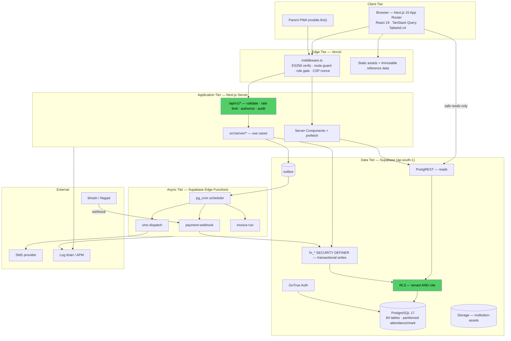

## 10.2 Request flow (target — write path)

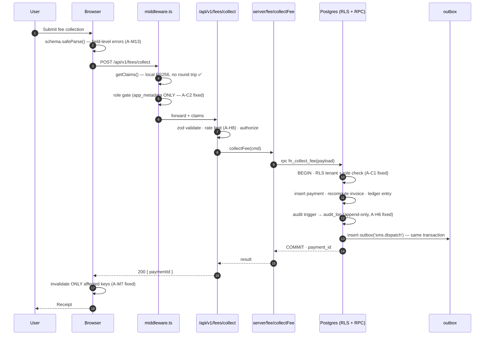

## 10.3 Authentication & authorization flow

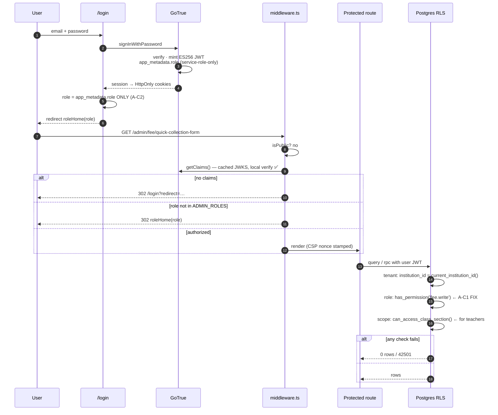

## 10.4 API flow — the two sanctioned paths

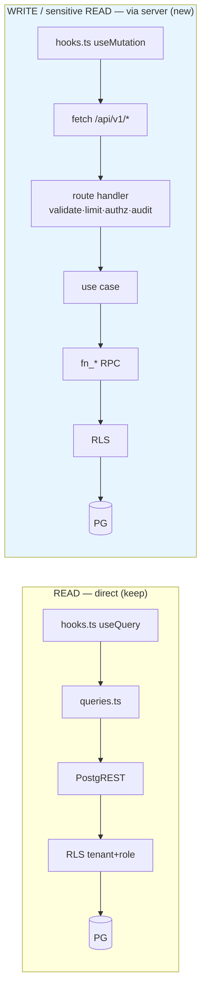

**Rule:** a read that RLS already makes safe stays direct — proxying 65 read queries through Next adds a hop and buys nothing. Writes and money/PII-sensitive reads go through the server tier, where rate limiting, audit, and orchestration can exist.

## 10.5 Database flow — fee collection

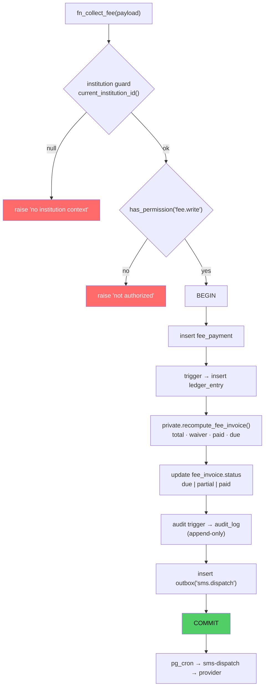

## 10.6 Module dependency flow

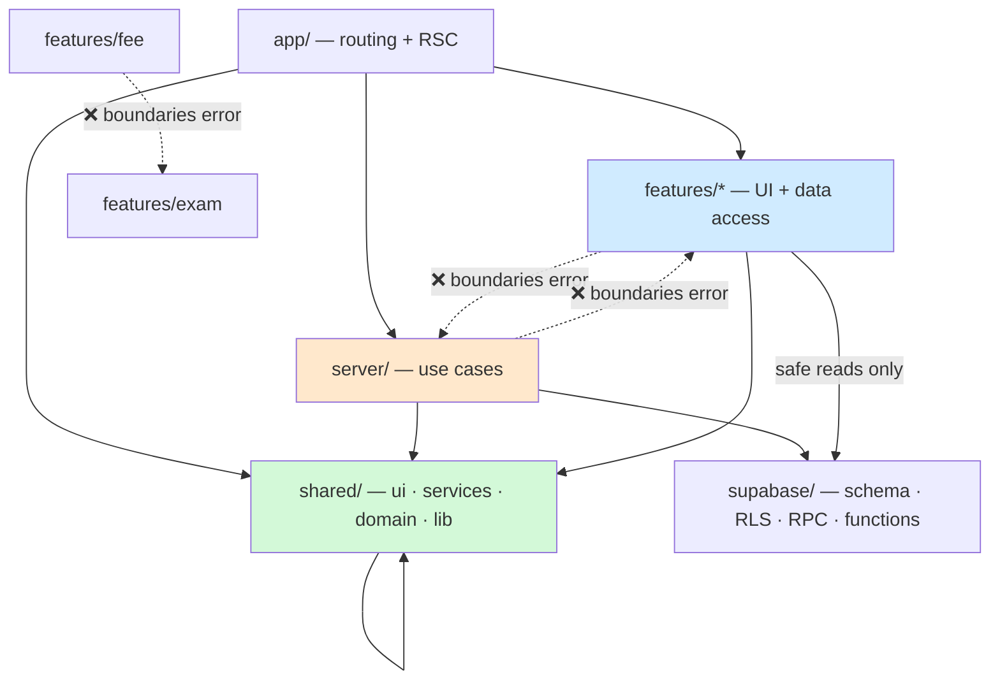

## 10.7 Layered architecture

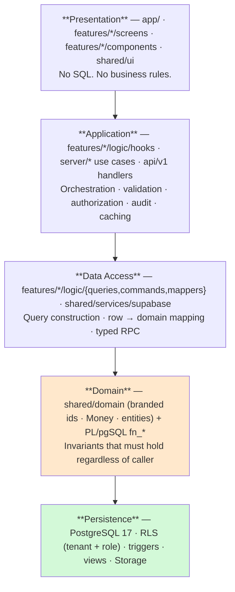

## 10.8 Deployment architecture

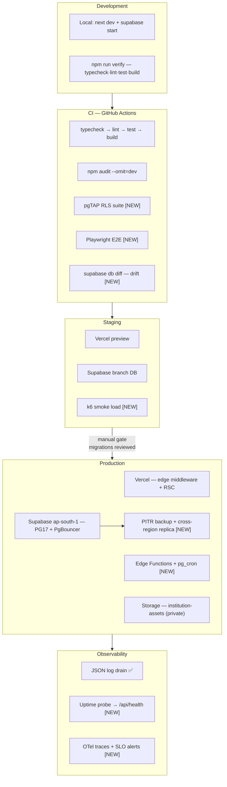

---

# 11. Final Production Architecture

## 11.1 The target, in one paragraph

**A multi-tenant Next.js 15 application over Supabase PostgreSQL, where the database enforces both tenancy and role, a thin Next.js server tier owns writes (validation, rate limiting, authorization, audit), reads stay direct where RLS already makes them safe, and everything slow or outbound runs asynchronously through a transactional outbox drained by Edge Functions on `pg_cron`.**

That is a small change from what exists. It is also the difference between a demo and a product.

## 11.2 The seven properties, and how each is achieved

| Property | Mechanism | Status |
|---|---|---|
| **Performance** | Local ES256 JWT verify ✅ · router cache ✅ · RSC prefetch (2/71 → all hot screens) · pagination on all lists · partitioned hot tables · split bundles · edge-cached reference data | 40% |
| **Scalability** | Shared-schema tenancy with `institution_id` shard key ✅ · partitioning · async tier · read replica · PgBouncer | 35% |
| **Maintainability** | Machine-enforced boundaries ✅ · feature slicing ✅ · zero `any` ✅ · shared domain types · typed RPC · deduplicated form/mapper layers | 70% |
| **Security** | Forced RLS ✅ · `search_path=''` ✅ · CSP nonce ✅ · fail-closed prod ✅ · **+ role-based RLS · app_metadata-only role · append-only audit · rate limiting** | 55% |
| **Reliability** | Transactional RPCs ✅ · structured errors ✅ · outbox with retry · restore drill · SLO + alerting | 45% |
| **Clean code** | 0 `any`, 3 TODOs, ~64 LOC/file ✅ · why-comments ✅ · − 67 `as unknown as` | 80% |
| **DX** | `npm run verify` ✅ · CI gates ✅ · ADRs ✅ · runbook ✅ · + E2E + seeded fixtures | 70% |

## 11.3 Improvement roadmap

### Phase 0 — Security stop-the-line · 8 days · **before any real school** — ✅ **COMPLETE (2026-07-26)**

| # | Action | Finding | Days | Status |
|---|---|---|---|---|
| 0.1 | Delete `user_metadata` role fallback (4 sites) + backfill audit + middleware test | **A-C2** | 0.5 | ✅ |
| 0.2 | `private.has_permission()` + verb-split role policies on all 84 tables | **A-C1** | 4 | ✅ |
| 0.2c | *(added)* Permission-guard all 48 `SECURITY DEFINER` RPCs | **A-C1** | — | ✅ |
| 0.3 | Wire `can_access_class_section()` on attendance/mark/enrollment | A-C1 | 1 | ✅ |
| 0.4 | Parent read-only scoping via `student_guardian` | A-C1 | 1 | ✅ |
| 0.5 | Audit log → append-only + extend to 14 more tables | **A-H6** | 0.5 | ✅ |
| 0.6 | pgTAP RLS suite in CI — **the proof artefact** | A-M14 | 1 | ✅ |

**Exit criterion:** a pgTAP test proves a parent session cannot select from `student` or update `mark`, and it runs on every PR. — **met.** `supabase/tests/rls_roles.test.sql`, 30 assertions, run by the `rls` job in `.github/workflows/ci.yml`.

**0.2c was not in the original plan and had to be.** §5.2 scoped A-C1 to table policies, but the 48 `public.fn_*` functions are `SECURITY DEFINER` and therefore bypass RLS: every one was granted to `authenticated` and none checked a permission. A parent could `POST /rest/v1/rpc/fn_save_marks` and the write would land regardless of the new policies. Fixing only the tables would have made the pgTAP suite actively misleading. Each implementation now lives in `private` (unexposed, EXECUTE revoked) behind a same-named `public` wrapper that calls `private.require_permission()`.

**Delivered:** migrations `20260726043308` … `20260726044457` (6), plus `roleFromClaims()` + 4 middleware tests.
**Design note:** rather than inventing an `<domain>.read` / `<domain>.write` catalogue, the policies reuse the 28 permission codes already seeded in `10_seed_global` (+ one new `audit.read`). Shared academic structure (class, section, subject, calendar) stays tenant-only on SELECT and `core.settings` on write — it carries no personal data and every screen needs it. `teacher`, `accountant` and `exam_controller` had **zero** `role_permission` rows since day one; they are now seeded, which is what turns fail-closed policies from a lockout into a working RBAC.

### Phase 1 — Scale & correctness · 10 days

| # | Action | Finding | Days |
|---|---|---|---|
| 1.1 | Pagination on all 51 unbounded queries (reuse `shared/ui/Pagination`) | **A-H4** | 3 |
| 1.2 | Partition `attendance` + `mark` by `academic_year_id` | **A-H5** | 2 |
| 1.3 | Explicit academic-year scoping on every year-sensitive query | **A-M16** | 2 |
| 1.4 | `ix_fee_payment_inst_paid` + `deleted_at` partial indexes | A-M9/10 | 0.5 |
| 1.5 | Precise cache invalidation; `queryKeys` to 100% + lint ban on inline keys | A-M7/M8 | 1.5 |
| 1.6 | `callRpc()` helper; delete 9 `RpcFn` + 67 `as unknown as` | A-M1 | 1 |

### Phase 2 — The missing tiers · 12 days

| # | Action | Finding | Days |
|---|---|---|---|
| 2.1 | `src/server/` + `/api/v1/*` with validate·limit·authz·audit middleware | A-H8 | 3 |
| 2.2 | Outbox table + `pg_cron` + Edge Function drainer | **A-H7** | 2 |
| 2.3 | Real SMS provider integration via outbox | **A-H9** | 2 |
| 2.4 | bKash/Nagad gateway + webhook + signature verify + reconciliation | **A-H9** | 3 |
| 2.5 | Set-based rewrite of `fn_run_migration` | A-H7 | 1 |
| 2.6 | Monthly invoice generation job | — | 1 |

### Phase 3 — Product completion & operations · 10 days

| # | Action | Finding | Days |
|---|---|---|---|
| 3.1 | Wire the parent portal to real data (6 screens) | **A-H9** | 3 |
| 3.2 | Playwright E2E: login → collect fee → verify ledger | A-M14 | 2 |
| 3.3 | k6 load test at 200k-student fixture | A-M14 | 1 |
| 3.4 | Prefetch roll-out to 10 hot screens + `next/dynamic` splitting | A-M11/12 | 2 |
| 3.5 | Uptime probe, SLOs, alert routes, OTel spans | A-M20 | 1 |
| 3.6 | Restore drill + RPO/RTO + `db diff` drift check in CI | A-M15 | 1 |

### Phase 4 — Refinement · 8 days

Shared domain types with branded ids and `Money` (§8.2) · `useEntityForm()` to kill 9 duplications · `logic/` SRP split · flatten `features/admin/*` → `features/*` · field-level validation errors · `shared/ui` subpath exports · retention/archival jobs.

**Total: ~48 engineer-days to a genuinely deployment-ready enterprise system.** Phase 0 alone (8 days) removes every critical.

## 11.4 Final architecture score

| Dimension | Weight | Score | Weighted |
|---|---|---|---|
| Architecture & structure | 15% | 85 | 12.8 |
| Code quality | 12% | 82 | 9.8 |
| Database design | 15% | 84 | 12.6 |
| **Security** | 18% | **42** | **7.6** |
| Performance | 12% | 62 | 7.4 |
| Scalability | 12% | 48 | 5.8 |
| Testing | 8% | 40 | 3.2 |
| Operability & DevOps | 8% | 62 | 5.0 |

# **FINAL ARCHITECTURE SCORE: 64 / 100 — Grade C+**

### What that number means

**This is not a 64 because the engineering is weak.** Structure scores 85. Database design scores 84. Code quality scores 82. Those are strong numbers, honestly earned, and they are the result of real architectural discipline — enforced boundaries, generated policies, an expert index set, and comments that will still be useful in three years.

The score is 64 because **security carries the heaviest weight and scores 42**, and it scores 42 for one reason: *the authorization model was designed and never connected*. `private.has_role()` and `private.can_access_class_section()` are written, granted, and called by zero policies. The `role` / `permission` / `role_permission` tables are modelled and enforced nowhere. The intent is fully present in the codebase; the wiring is not.

That is an unusually *fixable* 64. Phase 0 is eight days of work — most of it a `do $$` loop that follows the pattern the existing policies already establish — and it moves the score to **~78 (B+)**. Phases 0–2 reach **~88 (A−)**, which is production-grade for a 100-school deployment. The full roadmap reaches **~95 (A)**.

### For the defense panel

State it plainly and it becomes a strength rather than a liability:

> "We built multi-tenant isolation with forced row-level security on all 84 tables and machine-enforced architectural boundaries. Our own architectural audit found that tenant isolation was complete but role-based authorization was designed and not wired — every policy was `for all to authenticated`. We fixed it, and we wrote pgTAP tests that fail if a parent can read another student's record. Here is the test."

Finding your own critical vulnerability, remediating it, and proving the remediation with an automated test **is the strongest possible demonstration of engineering maturity** — considerably stronger than a project that had no such flaw because it never had a security model to get wrong.

---

## Appendix A — Complete findings register

| ID | Severity | Finding | Location |
|---|---|---|---|
| **A-C1** | **Critical** | No role-based authorization in RLS; `has_role`/`can_access_class_section` defined but referenced by zero policies | `06_rls_policies.sql`; `05_functions_triggers.sql:13-30` |
| **A-C2** | **Critical** | Role read falls back to client-writable `user_metadata`; middleware comment falsely claims otherwise | `supabase/middleware.ts:59`; `middleware.ts:78`; `login/page.tsx:61`; `app/page.tsx:21` |
| **A-H4** | High | 51 of 65 queries unbounded (no `.range`/`.limit`) | all `logic/api.ts` |
| **A-H5** | High | `attendance`/`mark` unpartitioned — 66M/12M rows at 3 yrs | `02_core_tables.sql` |
| **A-H6** | High | Audit log covers 6/84 tables and is client-deletable | `05_functions_triggers.sql:69-75`; `06_rls_policies.sql:86` |
| **A-H7** | High | No async tier; `fn_run_migration` is a row-by-row loop | `16_student_module_rpcs.sql`; no `supabase/functions/` |
| **A-H8** | High | No application rate limiting (auth endpoint only) | system-wide |
| **A-H9** | High | Parent portal mock, SMS never sent, no payment gateway | `features/parent/*`; migration 25; `DigitalCollectionScreen.tsx` |
| **A-M1** | Medium | `RpcFn` duplicated 9×, ~30 casts, return types discarded | all `logic/api.ts` |
| **A-M2** | Medium | Form state + dirty tracking hand-rolled in 9–10 screens | `features/admin/*/screens/*` |
| **A-M3** | Low | `supabase/README.md` lists 34 of 35 migrations | `supabase/README.md` |
| **A-M4** | Low | `shared/ui` full barrel widens chunks | `shared/ui/index.ts` |
| **A-M5** | Low | `config` boundary element declared, `src/config/` absent | `eslint.config.mjs:41` |
| **A-M6** | Medium | Bidirectional `student` ↔ `student_enrollment` 1:1, no enforced writer | `02_core_tables.sql` |
| **A-M7** | Medium | 13 of 30 invalidations namespace-wide → refetch storms | `*/logic/hooks.ts` |
| **A-M8** | Medium | 89 inline query keys vs 17 factory uses | system-wide |
| **A-M9** | Medium | Missing `fee_payment (institution_id, paid_at)` index | `04_indexes_constraints.sql` |
| **A-M10** | Medium | Soft delete pervasive, no `deleted_at` lookup indexes | `04_indexes_constraints.sql` |
| **A-M11** | Medium | Zero `next/dynamic`/`lazy`; 15 MB `.next/static` | system-wide |
| **A-M12** | Medium | `prefetchQueryState` used on 2 of 71 pages | `app/**` |
| **A-M13** | Medium | Zod never run in UI; field errors collapse to one toast | `features/**/*.tsx`; `errors.ts:75` |
| **A-M14** | Medium | 11 tests / 247 sources; no RLS, E2E, load, or migration tests | `tests/`, `src/**/*.test.ts` |
| **A-M15** | Medium | DR untested; single region; no RPO/RTO; no drift check | `docs/RUNBOOK.md` |
| **A-M16** | Medium | Academic year implicit — year-two data silently doubles lists | all `logic/api.ts` |
| **A-M17** | Medium | Bus factor 1 | repository history |
| **A-M18** | Medium | `profile.institution_id` failure → silent empty app | `05_functions_triggers.sql:2-5` |
| **A-M19** | Medium | No feature flags | system-wide |
| **A-M20** | Medium | `/api/health` unpolled; no SLO or alerting | `app/api/health/route.ts` |
| **A-L1** | Low | `features/admin/` nests by role, not domain | `src/features/` |
| **A-L2** | Low | `v_dashboard_kpi` recomputes 5 aggregates per load | `09_views.sql` |
| **A-L3** | Low | 203 `useState` / 51 `useEffect` / 23 memoizations | `features/**/*.tsx` |
| **A-L4** | Low | No i18n fallback; missing translation invisible | `shared/i18n/useT.ts` |
| **A-L5** | Low | Verify `.env.local`, `.next/`, `tsconfig.tsbuildinfo` gitignored | repo root |

## Appendix B — Verified metrics

| Metric | Value |
|---|---|
| TypeScript/TSX files | 247 |
| Total LOC | 21,139 (15,815 hand-written; 5,324 generated types) |
| Largest hand-written file | 422 (`TeacherForm.tsx`) |
| Routes / pages | 71 (58 server, 13 client) |
| Screen components | 56 |
| Client-component files | 96 |
| HTTP route handlers | **1** (`/api/health`) |
| Server Actions | 0 |
| Supabase Edge Functions | 0 |
| Data-access modules (`api.ts`) | 15 |
| Query-hook modules (`hooks.ts`) | 10 |
| `useQuery` / `useMutation` | 66 / 20 |
| `.select()` calls | 65 (14 bounded) |
| `invalidateQueries` calls | 30 (13 namespace-wide) |
| Inline query keys / factory uses | 89 / 17 |
| `as unknown as` | 67 across 16 files |
| `any` / `@ts-ignore` / `@ts-expect-error` | 0 / 0 / 0 |
| `TODO`+`FIXME`+`HACK` | 3 |
| `console.*` | 3 |
| `next/dynamic` + `React.lazy` | 0 |
| `useState` / `useEffect` / memoizations | 203 / 51 / 23 |
| Test files | 11 |
| SQL migrations | 35 (3,175 LOC) |
| Database tables | 84 (RLS forced on all) |
| RLS policies with a role check | **0** |
| Tables covered by audit trigger | **6 of 84** |
| `SECURITY DEFINER` RPCs | 30+ |
| `.next/static` | 15 MB |

---

*Audit conducted 2026-07-26 by direct source inspection. Every finding cites a file and, where applicable, a line. No finding was carried forward from prior documentation without independent re-verification against the current source.*
